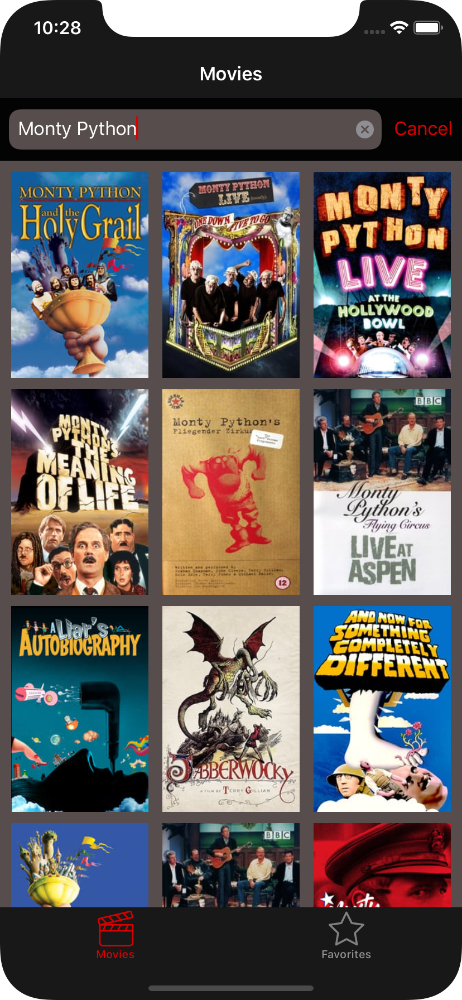
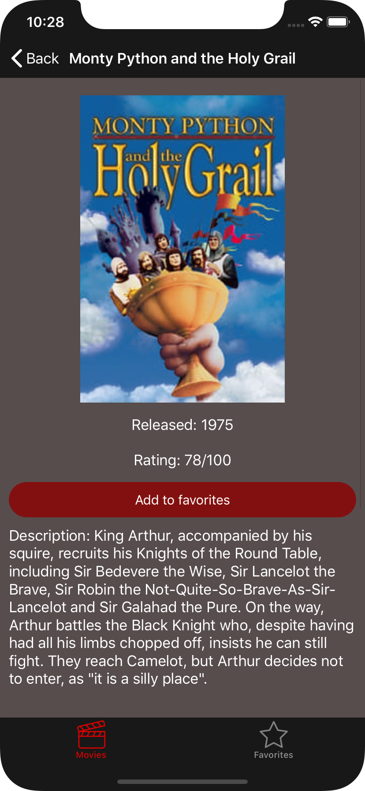
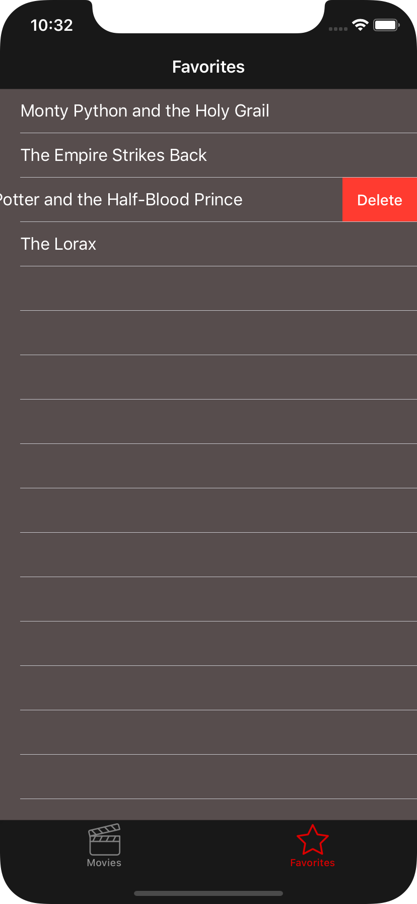

# movieApp
Fourth assignment for CSE 438. This is a movie search app that focuses on the design of IOS view structure and properly allocating threads for making the app work smoothly using multi-threading.

## About

 This app explores the use of multithreading in order to provide a smooth user experience. The app also connects with TMDB API to fetch and retrieve information about movies from their database. The user is able to search for movies as well as save movies to a favorites list. The app is also able to persist the data of the movies that are in the favorites list through the use of user defaults, this enables the movies to be remembered in between app launches.

 
